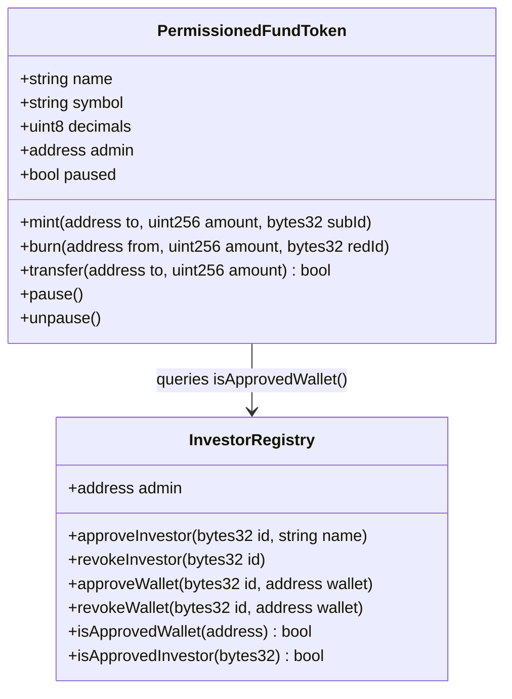

# Architecture Overview

## System Layers

This project models a tokenized fund as two coordinated layers — on-chain and off-chain — with a reconciliation bridge between them.

```
┌──────────────────────────────────────────────────────────┐
│                     Off-Chain Layer                       │
│                                                          │
│  Investor Master File    Subscription Records            │
│  Wallet Registry         Redemption Records              │
│  Expected Balances       Settlement Status                │
│                                                          │
│  ← Maintained by fund admin / transfer agent →           │
└──────────────────────────┬───────────────────────────────┘
                           │
                    Reconciliation
                     (reconcile.py)
                           │
┌──────────────────────────▼───────────────────────────────┐
│                     On-Chain Layer                        │
│                                                          │
│  InvestorRegistry.sol    PermissionedFundToken.sol        │
│  ─ Investor approval     ─ ERC-20 with transfer gates    │
│  ─ Wallet whitelist      ─ Mint on subscription          │
│  ─ Eligibility queries   ─ Burn on redemption            │
│                          ─ Admin pause                   │
│                                                          │
│  ← Immutable audit trail; enforces permissioning →       │
└──────────────────────────────────────────────────────────┘
```

## Contract Relationships



## Design Decisions

| Decision | Rationale |
|----------|-----------|
| Separate registry from token | Mirrors real-world separation between investor records (transfer agent) and asset issuance. Registry can serve multiple fund tokens. |
| 6-decimal precision | Common for fund-interest tokens; avoids floating-point issues that 18 decimals would introduce in off-chain reconciliation. |
| Admin-only mint/burn | Subscriptions and redemptions are not self-service. The fund admin validates off-chain before executing on-chain. |
| `bytes32 subscriptionId` in mint | Links on-chain action to off-chain instruction, making reconciliation possible. |
| Simulated on-chain snapshot | Keeps the repo self-contained. In production, this would be a live RPC call or indexer query. |
| CSV off-chain records | Simple and reviewable. In production, this would be a database or fund-admin platform export. |

## What Would Change in Production

- **Registry** would integrate with a KYC provider API and support multi-sig admin operations.
- **Token** would implement ERC-3643 or a comparable security-token standard with compliance modules for jurisdiction rules, holding periods, and investor-count caps.
- **Reconciliation** would run against a live indexer (e.g., The Graph, Goldsky) and feed results into an ops dashboard with alerting.
- **Off-chain records** would live in a transfer-agent platform (e.g., a regulated books-and-records system) rather than CSV files.
- **Deployment** would use a multisig (e.g., Safe) for admin operations rather than a single EOA.
