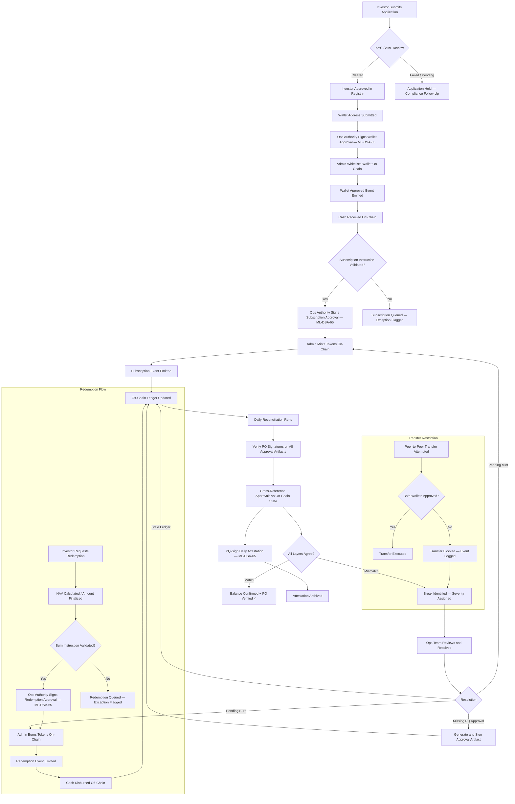

# Tokenized Fund Operations — Lifecycle Workflow

The diagram below traces the end-to-end lifecycle of a single investor from onboarding through daily reconciliation, including the post-quantum signing layer.

## Key Observations

**Where post-quantum signing applies:**

- Wallet approval (before on-chain whitelisting)
- Subscription approval (before on-chain minting)
- Redemption approval (before on-chain burning)
- Daily reconciliation attestation (after all checks complete)

**Where human intervention is required:**

- KYC/AML clearance decision (compliance officer)
- Subscription instruction validation (transfer agent)
- NAV strike and redemption amount finalization (fund administrator)
- Exception resolution after reconciliation breaks (ops team)

**Where automation helps but does not replace judgment:**

- Wallet whitelisting (admin executes, compliance approves)
- Mint and burn execution (admin executes after off-chain validation)
- PQ signature verification (automated; failures escalate to humans)
- Reconciliation (script identifies and classifies breaks, humans resolve them)

## Break Severity Classification

| Severity | Examples | Response Time |
|----------|----------|---------------|
| **Critical** | Invalid PQ signature; on-chain action without signed approval | Immediate escalation |
| **High** | Signed approval without on-chain execution; wallet without signed approval | Same-day resolution |
| **Medium** | Pending subscription/redemption; blocked transfer | Next business day |

This workflow mirrors the operational model of a real transfer agent or fund administrator managing tokenized securities. The on-chain layer handles custody and transfer restriction. The PQ signing layer secures operational authorizations. Everything else — eligibility, cash settlement, NAV calculation, exception management — remains off-chain and requires operational controls.
