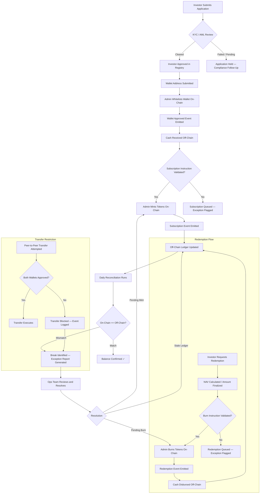

# Tokenized Fund Operations — Lifecycle Workflow

The diagram below traces the end-to-end lifecycle of a single investor from onboarding through daily reconciliation.

## Key Observations

**Where human intervention is required:**

- KYC/AML clearance decision (compliance officer)
- Subscription instruction validation (transfer agent)
- NAV strike and redemption amount finalization (fund administrator)
- Exception resolution after reconciliation breaks (ops team)

**Where automation helps but does not replace judgment:**

- Wallet whitelisting (admin executes, compliance approves)
- Mint and burn execution (admin executes after off-chain validation)
- Reconciliation (script identifies breaks, humans resolve them)

This workflow mirrors the operational model of a real transfer agent or fund administrator managing tokenized securities. The on-chain layer handles custody and transfer restriction. Everything else — eligibility, cash settlement, NAV calculation, exception management — remains off-chain and requires operational controls.
